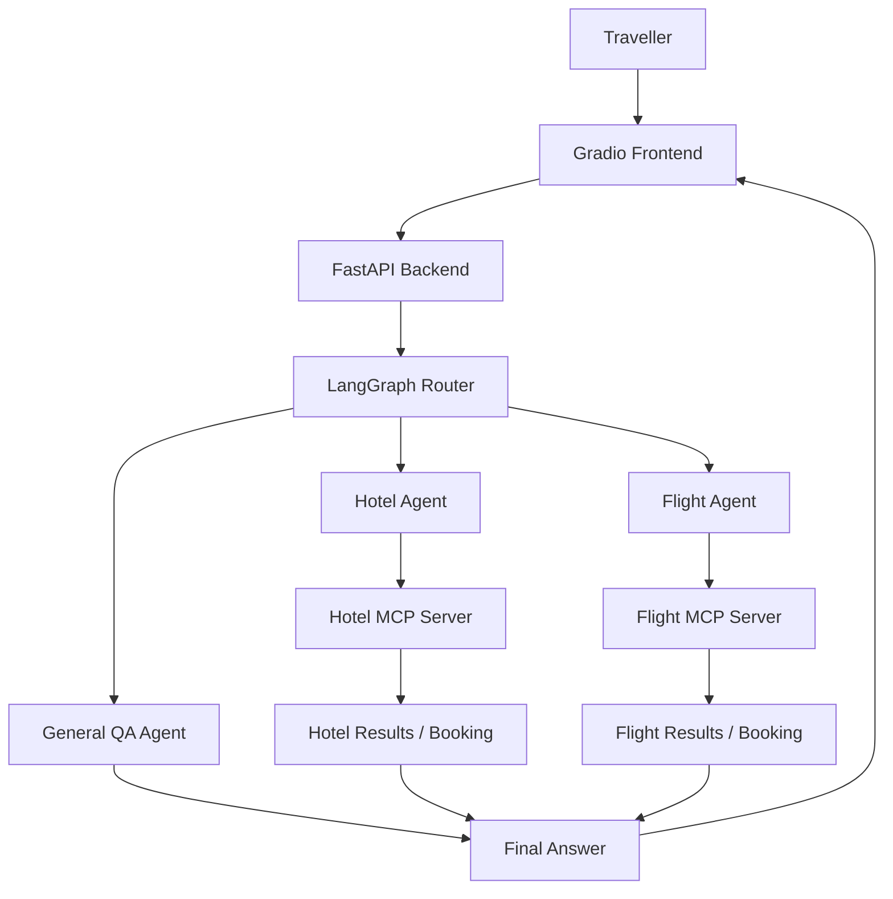

# TripWeaver - MCP-Based Multi-Agent Travel Planner

TripWeaver is a professional enhancement sprint implementation of a
multi-agent travel planner. It combines a FastAPI backend, LangGraph-style
intent routing, MCP hotel and flight servers, and a polished Gradio chat UI.

## Features

- Intent-routed multi-agent workflow for general travel Q&A, hotels, flights,
  and combined hotel-plus-flight planning.
- Separate MCP servers for hotel and flight capabilities.
- MCP tools for listing, searching, and booking hotels and flights.
- Live provider bridge using the Convex travel service URLs from the reference
  example, with local fallback data for reliable demos.
- OpenAI-grounded recommendation briefs that synthesize only the MCP results
  returned for the current request.
- Graceful service failure handling with user-friendly messages.
- Missing-detail follow-up questions instead of fabricated values.
- Streaming FastAPI endpoint with agent activity events.
- Travel-themed responsive Gradio frontend with quick prompts and copyable chat.
- Deployment-ready environment variable handling.

## Architecture



## Project Structure

```text
agents/
  config.py       Environment settings
  entity.py       Shared agent state schema
  graph.py        Intent-routed LangGraph workflow
  llm.py          Optional OpenAI chat model initialization
  mcp_client.py   MCP bridge used by agents
  nodes.py        Router, hotel, flight, general, finalizer nodes
mcp_servers/
  hotel_server.py Hotel MCP tools
  flight_server.py Flight MCP tools
main.py           FastAPI backend
frontend.py       Gradio frontend
```

## Local Setup

For the easiest Windows setup, read [RUN_FULL_PROJECT.md](RUN_FULL_PROJECT.md)
or run:

```bat
setup_windows.bat
start_backend.bat
start_frontend.bat
```

Manual setup:

1. Create a virtual environment.

```bash
python -m venv .venv
.venv\Scripts\activate
```

2. Install dependencies.

```bash
pip install -r requirements.txt
```

3. Create local environment config.

```bash
copy .env.example .env
```

4. Put your rotated OpenAI key in `.env`.

```bash
OPENAI_API_KEY=your-rotated-key
```

The app still runs with template responses if no OpenAI key is provided, but a
key gives better general travel answers.

## Run Locally

Terminal 1:

```bash
uvicorn main:app --reload --host 0.0.0.0 --port 8000
```

Terminal 2:

```bash
python frontend.py
```

Open the Gradio URL, usually `http://127.0.0.1:7860`.

## Example Prompts

- `Search hotels in Paris under $200`
- `Find flights from Colombo to Tokyo`
- `Plan hotel and flight for Colombo to Paris under $900`
- `Book hotel H-CMB-001 for Alex Morgan`
- `What should I pack for Paris in August?`

For a booking, replace `Alex Morgan` with the actual traveller name and use a
hotel or flight reference returned by the result card. The reference is a
provider identifier, not a personal name or hidden account value.
